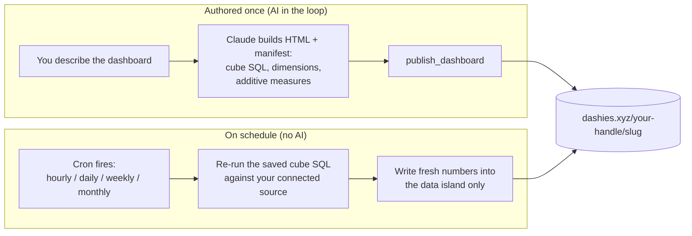

<div align="center">

# Dashies

**Publish AI-built dashboards to a shareable URL, then let them refresh themselves on a schedule - with no AI in the loop after the first build.**

A one-install [Claude Code](https://claude.com/claude-code) plugin: the `dashies` authoring skill plus the Dashies publish MCP server, bundled together.

[Website](https://dashies.xyz) ·
[Marketplace](https://dashies.xyz/marketplace.json) ·
[MCP server](https://mcp.dashies.xyz/mcp) ·
[Report an issue](https://github.com/MickeyBinnoon/dashies-plugin/issues)


</div>

---

## What it is

Dashies turns a Claude Code conversation into a published, self-contained BI dashboard at a stable URL: `https://dashies.xyz/<your-handle>/<slug>`.

You describe the dashboard. Claude builds it as a single HTML file (inline CSS, inline JS, embedded data) and publishes it with one MCP call. You get back a link you can share.

The part that makes Dashies different: **a dashboard can keep itself up to date.** When it is backed by a connected data source, Claude authors the dashboard plus a small JSON manifest (a cube of SQL, dimensions, and additive measures) exactly once. From then on a server-side cron re-runs that SQL on your chosen schedule and rewrites only the numbers in the dashboard's data island. The HTML is never touched again, and no model runs again.

> [!NOTE]
> Anyone can publish a dashboard. Scheduled auto-refresh is the flagship feature, and it requires the dashboard to be backed by a connected data source. A one-off static dashboard publishes fine - it just will not refresh on its own.

## Install

Two commands inside Claude Code:

```text
/plugin marketplace add https://dashies.xyz/marketplace.json
/plugin install dashies@dashies
```

That is the whole setup. The plugin bundles the `dashies` authoring skill and wires up the Dashies MCP server, so there is nothing to configure by hand and no token to paste.

> [!TIP]
> This replaces the older manual MCP setup (`claude mcp add dashies https://mcp.dashies.xyz/mcp --transport http --scope user`). If you ran that before, the plugin install supersedes it.

### Authentication: no tokens, ever

Dashies uses the standard MCP **OAuth 2.1 + PKCE** flow with **Dynamic Client Registration**. There are no API keys or tokens to copy, paste, or rotate. The first time you use a Dashies MCP tool, a browser opens for a one-click Google sign-in. The resulting access token is stored in your OS keychain and refreshes automatically; when it expires, the next tool call re-runs the one-click handshake.

## Quick start

Once installed, just ask:

```text
Publish a dashboard of last month's signups by plan.
```

Claude builds a self-contained HTML dashboard, calls `publish_dashboard`, and hands back a live URL:

```text
https://dashies.xyz/<your-handle>/signups-by-plan
```

That is the full loop: one request, one shareable link.

## How the no-AI refresh works

The model runs once, at authoring time. After that, refresh is pure server-side cron: it re-executes the saved SQL and writes the new numbers back into the published file's data island. The HTML, the layout, and the bindings stay untouched.



Why this design holds up:

- **The HTML never changes after publish.** Refresh swaps data, not markup, so a dashboard cannot drift or break visually between runs.
- **No model is in the refresh path.** Lower cost, deterministic output, and no risk of an AI re-interpreting your dashboard differently each cycle.
- **The cube is the contract.** A low-cardinality grain plus additive measures is what lets the same SQL re-aggregate forever without re-authoring.

## Features

- **Publish in one call.** A self-contained HTML dashboard becomes a stable, shareable URL scoped to your handle.
- **Self-refreshing dashboards.** Pick hourly, daily, weekly, or monthly. The server re-runs your cube SQL and updates the numbers, with no AI in the loop.
- **Zero-token auth.** OAuth 2.1 + PKCE + Dynamic Client Registration. One browser click, keychain-stored, auto-refreshing.
- **Safe renames.** Renaming a dashboard preserves the old URL with a 301 redirect, so links you already shared keep working.
- **Versioned bodies.** Republishing snapshots the prior body automatically (up to 20 retained). List and roll back to any snapshot.
- **Sandboxed by design.** Published dashboards render under a strict sandbox CSP, isolated from the rest of the origin.
- **Guided authoring.** The bundled `dashies` skill walks you through the connected-data gate, cube design, the data-island binding contract, the sandbox constraints, schedule choice, and the manifest.

## What's bundled

### The `dashies` authoring skill

Loads automatically after install. It is the playbook for building a *refreshable* dashboard: the connected-database gate, designing a cube with a low-cardinality grain and additive measures, the data-island and data-dash binding contract, the inlined client runtime, the sandbox CSP constraints, choosing a schedule, and writing the `source_config` manifest.

### The MCP tools

OAuth triggers on first use of any tool below (one browser click).

| Tool | What it does |
|---|---|
| `publish_dashboard` | Upload a self-contained HTML / JSON / CSV / image file (up to ~5 MB) and get a stable URL back. |
| `update_dashboard` | Edit metadata (name, tags, chart, visibility) or rename the slug without re-uploading the body. Renames keep the old URL alive via a 301 redirect. |
| `get_dashboard` | Read back a previously published file. |
| `delete_dashboard` | Retire a dashboard by slug. The URL stops resolving and the bytes are removed. |
| `list_dashboards` | Enumerate your active dashboards, newest first, with cursor pagination. |
| `list_dashboard_versions` | List the saved prior body snapshots of one of your personal dashboards, each with a `version_id`. |
| `restore_dashboard_version` | Roll a personal dashboard back to a prior snapshot. The current body is snapshotted first, so the restore is normally reversible. |
| `introspect_schema` | Inspect a connected data source's schema while authoring a cube. |
| `validate_cube_sql` | Check a cube's SQL against the connected source before publishing a refreshable dashboard. |

## Build your first refreshable dashboard

A refreshable dashboard needs a connected data source, so the authoring flow starts there.

1. **Connect a data source.** Auto-refresh re-runs SQL against a live source, so this is the gate. Without it you can still publish a static dashboard, but it will not refresh on its own.
2. **Ask Claude to build it.** For example: *"Build a refreshable dashboard of weekly active users by plan, and refresh it daily."* The `dashies` skill takes over from here.
3. **Design the cube.** Claude uses `introspect_schema` to read your tables, then defines a cube: a low-cardinality grain (the dimensions you slice by) and additive measures (counts, sums) that can be re-aggregated safely every cycle.
4. **Validate the SQL.** `validate_cube_sql` confirms the cube runs against your source before anything is published.
5. **Publish with a schedule.** Claude calls `publish_dashboard` with the HTML plus the `source_config` manifest and your chosen cadence (hourly / daily / weekly / monthly). You get back `https://dashies.xyz/<your-handle>/<slug>`.
6. **Walk away.** The cron re-runs the cube SQL on schedule and writes fresh numbers into the data island. The dashboard stays current with no further AI involvement.

> [!TIP]
> For a one-off snapshot with no live data behind it, you do not need the cube or the manifest. Just ask Claude to publish a static dashboard - one `publish_dashboard` call and you have a URL.

<details>
<summary>Common follow-up requests</summary>

- **"What dashboards do I have?"** - Claude calls `list_dashboards` and summarizes them, newest first.
- **"Rename this dashboard."** - Claude calls `update_dashboard` with a new slug. The old URL 301-redirects to the new one, so shared links keep working.
- **"Roll this back."** - Claude calls `list_dashboard_versions` to find a snapshot, then `restore_dashboard_version` to restore it (personal dashboards only).
- **"Make it private."** - Claude calls `update_dashboard` with the visibility change; no re-upload needed.

</details>

## Links

- Home: https://dashies.xyz
- Marketplace manifest: https://dashies.xyz/marketplace.json
- MCP server: https://mcp.dashies.xyz/mcp
- Issues: https://github.com/MickeyBinnoon/dashies-plugin/issues

## License

[MIT](LICENSE).

---

<div align="center">

Built by [Trievox Studio](https://dashies.xyz). Dashboards that keep themselves up to date.

</div>